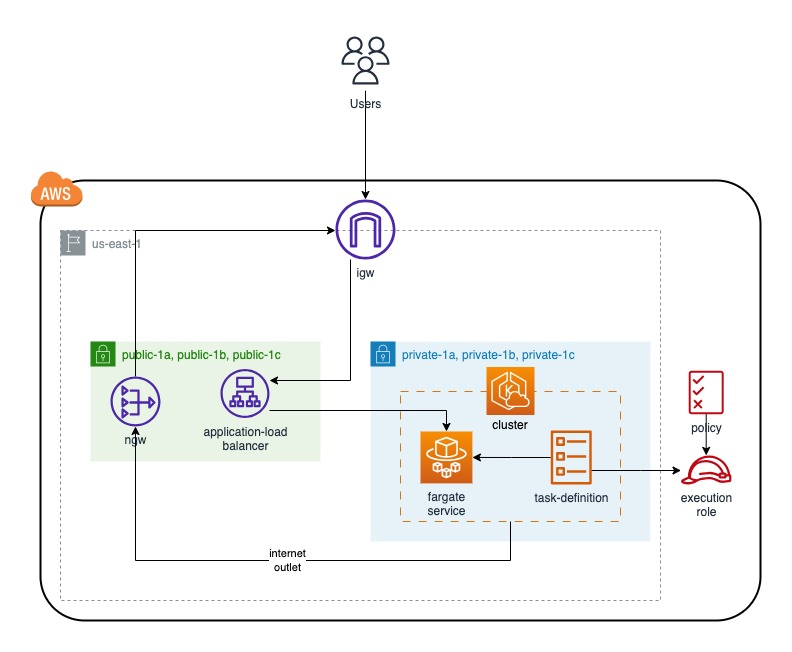

# Deploying ECS APP



Prerequisites:

- [AWS Cli installed](https://docs.aws.amazon.com/cli/latest/userguide/getting-started-install.html "AWS Cli installed")

- [AWS Session Manager plugin](https://docs.aws.amazon.com/systems-manager/latest/userguide/session-manager-working-with-install-plugin.html#install-plugin-macos-signed "AWS Session Manager plugin")

- [Configure AWS profile](https://docs.aws.amazon.com/cli/latest/userguide/cli-chap-configure.html "Configure AWS profile")

To deploy the components using CDK please following the next steps:

- Clone this [Repository](https://github.com/cloudcampla/ecs-app "Repository")

```
cd ecs-app/cdk
```

- Install the dependencies use node version 16 or higer:

```
npm install
```

- To deploy hall the stacks execute the following command:

```
cdk deploy --all
```

- How to interact inside the container:

```
aws ecs execute-command --cluster applications \
    --task <your-task-arn> \
    --container app\
    --command "/bin/sh" \
    --interactive
```

- How destroy all the services:

```
cdk destroy --all
```
